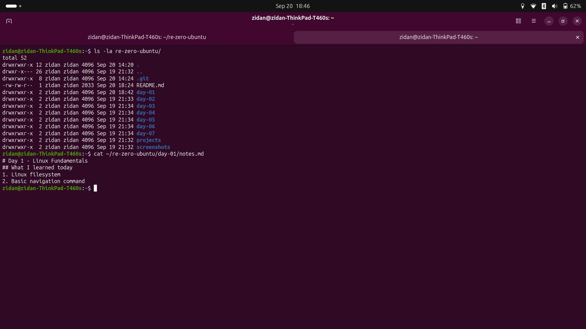
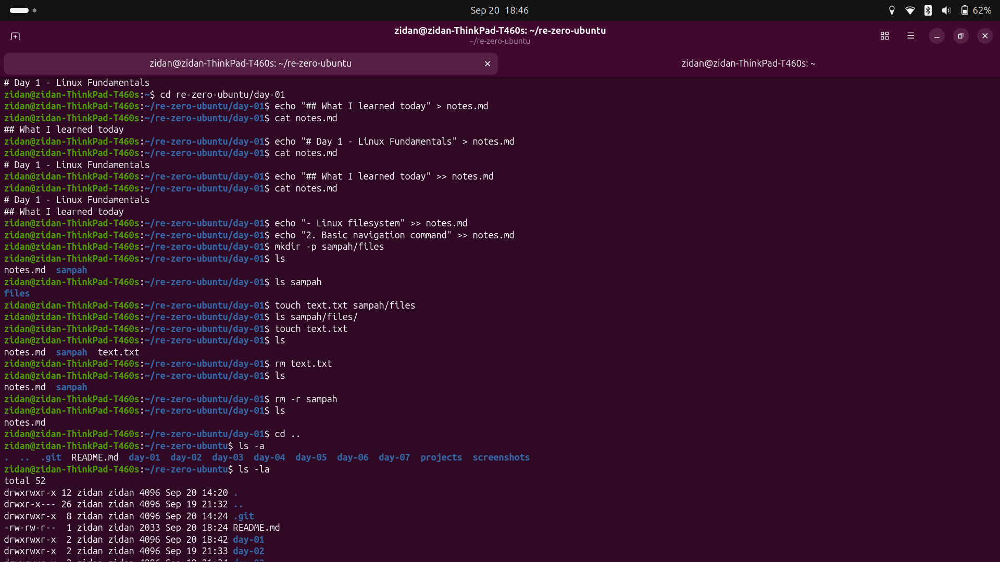
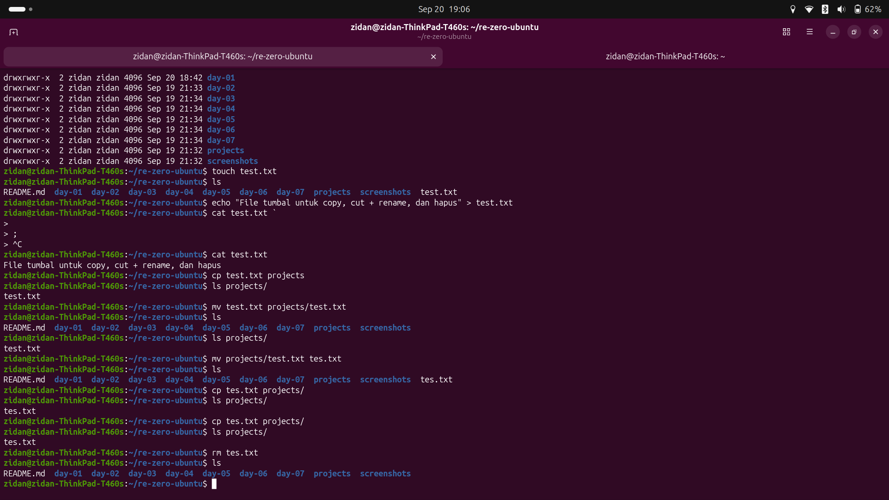

# Day 1 - Linux Fundamentals
## Daily target
- Learn the Linux filesystem structure.
- Learn basic Linux commands.
- Familiarize myself with the terminal and its functionalities.

## What I learned today
1. Linux filesystem
2. Basic commands

### Linux filesystem
In Linux, we don't use drive letters like `C:\` or `D:\`, but instead organizes everything under a single root directory (`/`).  

Comparison between Windows and Linux filesystem:
| Windows | Linux | Function |
| --- | --- | --- |
| C:\ | / (root) | Root directory |
| C:\Users\ | /home/username | User home directories |
| C:\Program Files\ | /usr/bin/ & /usr/share/ | System programs and shared files |
| D:\ (other drives) | /mnt/d/ (or other mount points) | Mounted drives |
| C:\Windows\System32 | /bin/ & /sbin/ | Contains basic Linux commands (ls, cd, mv, cp, etc.) |  

Other directories in Linux:
- `/etc/` - Configuration files for the system and applications.
- `/var/` - Variable data files, such as logs, databases, and web content (www in laragon).
- `/tmp/` - Temporary files that are often cleared on reboot.
- `/dev/` - Device files that represent hardware devices. In Linux, everything is treated as a file, including hardware devices.
- `.` - Current directory.
- `..` - Parent directory.
- `~` - Home directory of the current user.

### Basic commands
| Command | Syntax | Description | Categories |
| --- | --- | --- | --- |
| `pwd` | `pwd` | Print working directory - shows the current directory you are in. | Navigation |
| `ls` | `ls` | List files and directories in the current directory. | Navigation |
| `cd` | `cd <directory>` | Change directory to the specified directory. | Navigation |
| `mkdir` | `mkdir <directory>` | Create a new directory. | File Management |
| `touch` | `touch <file>` | Create a new empty file. | File Management |
| `cp` | `cp <source> <destination>` | Copy files or directories. | File Management |
| `mv` | `mv <source> <destination>` | Move or rename files or directories. | File Management |
| `rm` | `rm <file>` | Remove files or directories. Use `-r` for recursive deletion of directories (dangerous! use with caution) | File Management |  

### Example commands
> This is a simple example of how to create a project folder and a file inside it, then move the file to another directory.

```bash
# Create a project folder
mkdir my_project
# Navigate into the project folder
cd my_project
# Create a new file
touch my_file.txt
# Add some content to the file
echo "Hello, Linux!" > my_file.txt
# Look at the contents of the file
cat my_file.txt
# Move the file to another directory (e.g., /tmp/)
mv my_file.txt /tmp/
# Verify the file has been moved
ls /tmp/
```  

### Troubleshooting
-

### Screenshots


