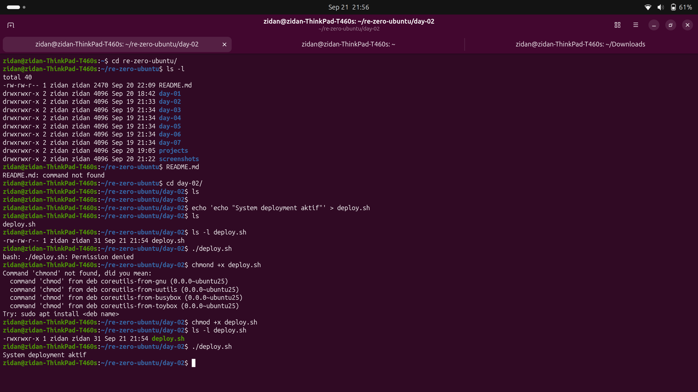

# Day 2 - Linux Permissions, Sudo, & Package Management
## Daily Target
- Learn about Linux file permissions.
- Learn about sudo (superuser do).
- Learn about package management.

## What I learned today
1. Linux File Permissions
2. Sudo (Superuser Do)
3. Package Management

### Linux file permissions
Use `ls -l` to view file permissions.  

The output looks like this:  
`-rw-r--r-- 1 username groupname 1234 Dec 31 23:59 filename` or `drwxr-xr-x 1 username groupname 1234 Dec 31 23:59 filename`  
where:  
| simbols | desc | meaning | number |
| --- | --- | --- | --- |
| `-` | file | that mean, this is a file | - |
| `d` | directory | that mean, this is a directory | - |
| `w` | write | that mean, this file can be written to or modified | 2 |
| `r` | read | that mean, this file can be read | 4 |
| `x` | execute | that mean, this file can be executed | 1 |

Give permissions to file, use: `chmod` command.  
`chmod` command can be used to change the permissions of a file or directory.  

**Syntax:**  
`chmod <permissions> <file>`  
Example:  
`chmod 777 filename`

### Sudo (Superuser Do)
Sudo, stands for superuser do.  
Use this command to run commands as the root user.  
**Syntax:**  
`sudo <command>`  
Example:  
`sudo apt install <package>`  

### Package Management
In Linux, we use `apt` command to manage packages.  
**Syntax:**  
`sudo apt <command>`  
Example:  
`sudo apt install <package>`  

#### Common commands:
- `sudo apt update` - Update the package list.
- `sudo apt upgrade` - Upgrade the installed packages.
- `sudo apt install <package>` - Install a package.
- `sudo apt remove <package>` - Remove a package.
- `sudo apt search <package>` - Search for a package.
- `sudo apt show <package>` - Show information about a package.

### Troubleshooting
-  

### Screenshots
