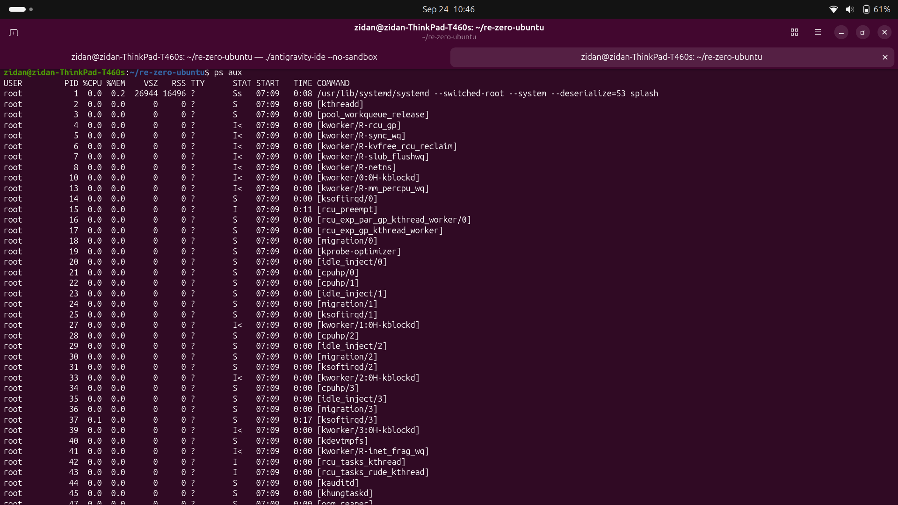
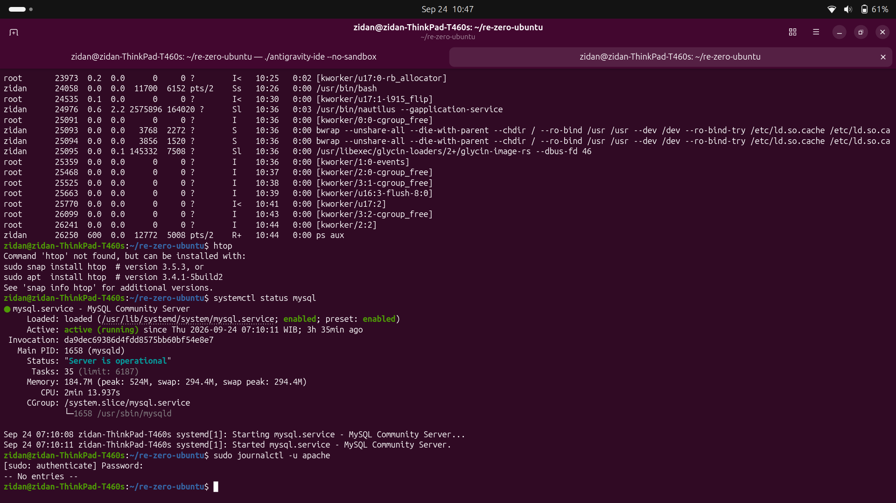
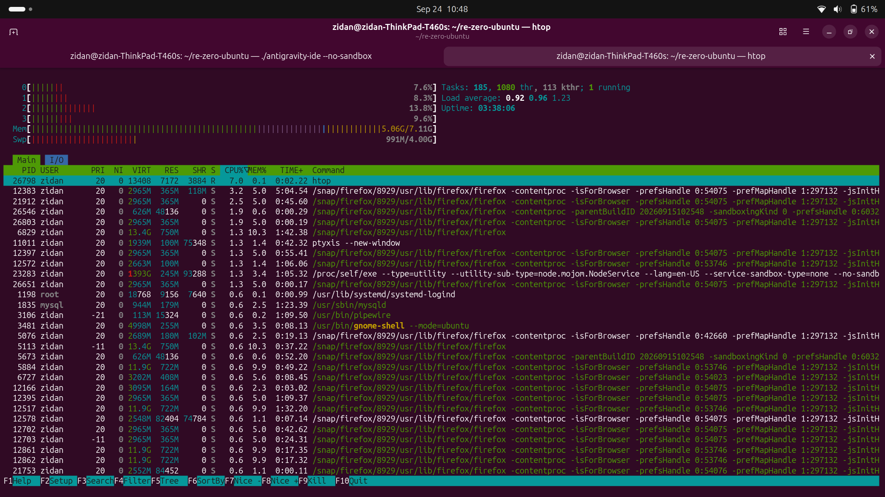
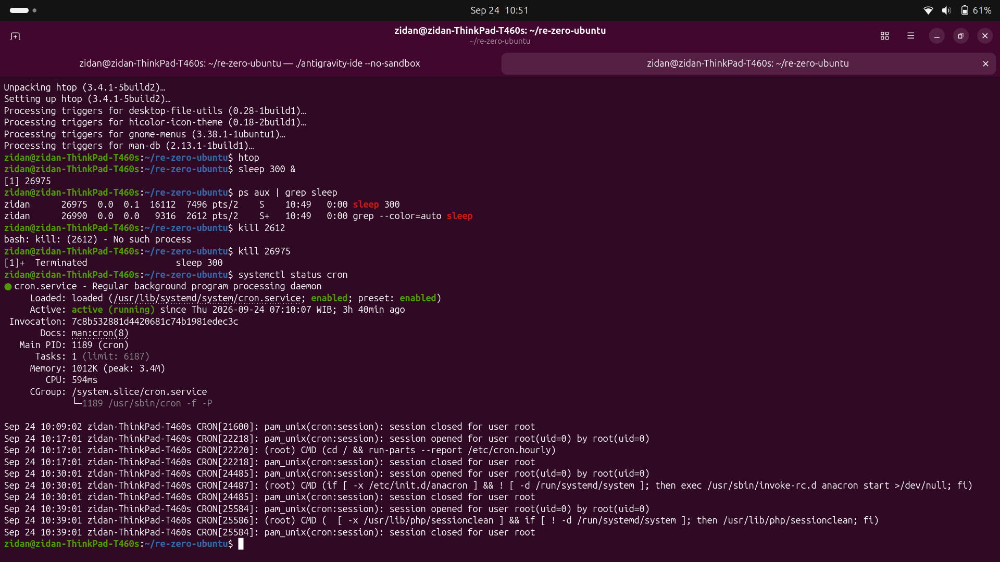

# Day 3 - Linux Processes, Services, & Troubleshooting
## Daily Target
- Learn about processes in Linux.
- Learn about services in Linux.
- Learn about troubleshooting in Linux.

## What I learned today
1. Linux Program
2. Linux Processes
3. Linux Services
4. Linux Troubleshooting

### Linux Programs (file biner/script)
Programs is a software that saved in disk, not running yet. In Windows, we can see programs in Start Menu and installed programs list in Settings. In Linux, we can see programs in Applications menu and installed programs list in Software Center (Ubuntu) or Synaptic Package Manager.  

Saved in `/bin`, `/sbin`, `/usr/bin`, `/usr/sbin`.  
example: `/usr/bin/mysql`  

### Linux Processes
Process is a program that is running. In Windows, we can see processes in Task Manager. In Linux, we can see processes in `htop` or `ps` command.  
**Syntax:**  
`ps <command>`  
Example:  
`ps aux`  

### Linux Services
Service is a process that is running in the background. In Windows, we can see services in Services Manager. In Linux, we can see services in `systemctl` command.  

In Linux, we can use `systemctl` command to view services.  
**Syntax:**  
`systemctl <command>`  
Example:  
`systemctl status`  

### Linux Troubleshooting
In Linux, we can use `journalctl` command to view logs.  

For troubleshooting, we can use `journalctl` command to view logs, and kill it using `kill` command.  

**Syntax:**  
`journalctl <command>`  
Example:  
`journalctl -u <service>`  

### Troubleshooting
-

### Screenshots

