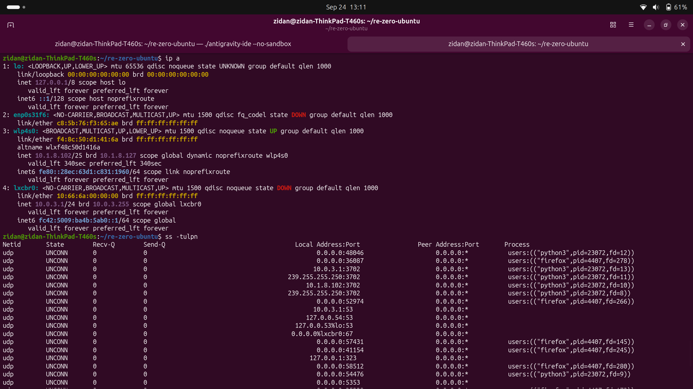
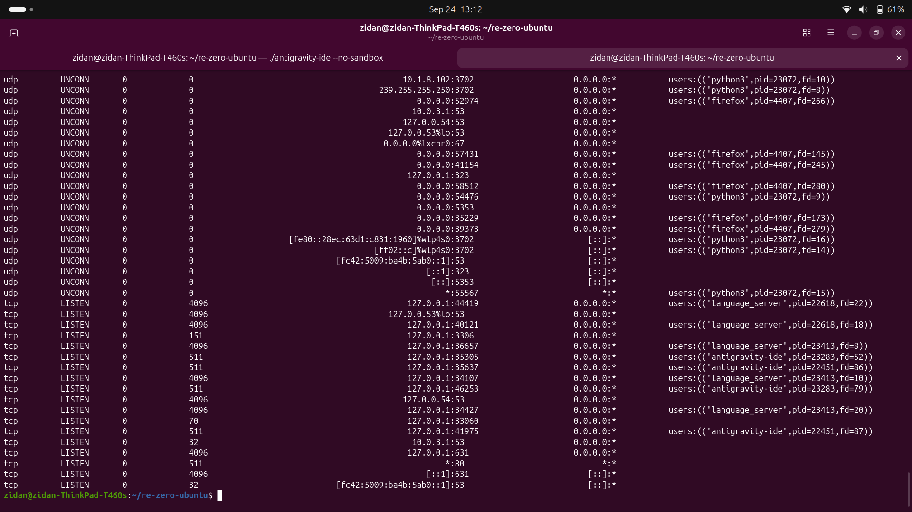
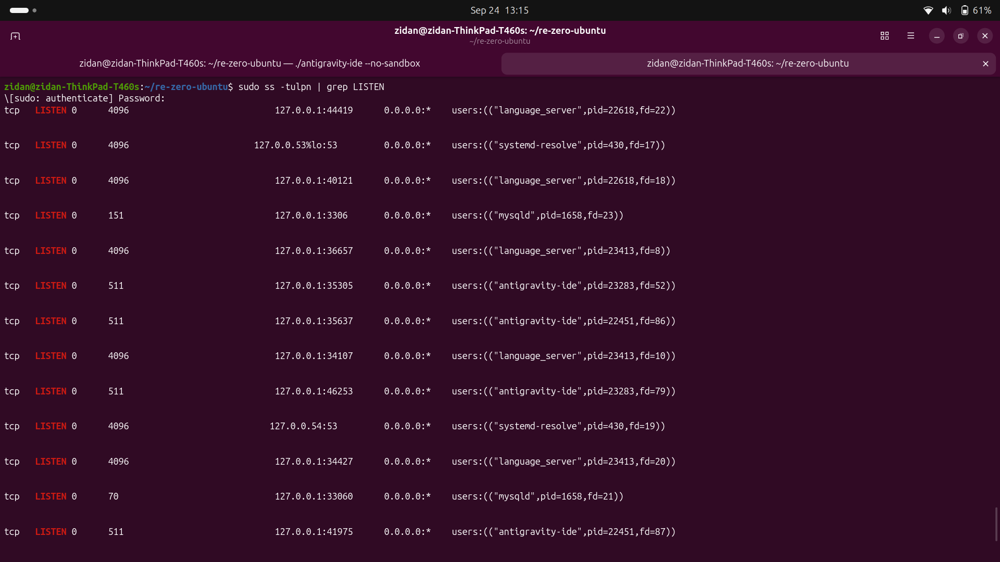
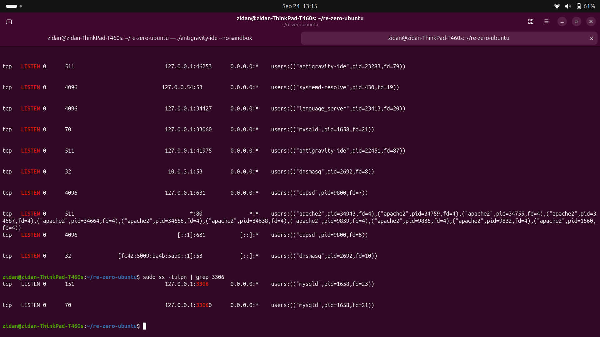
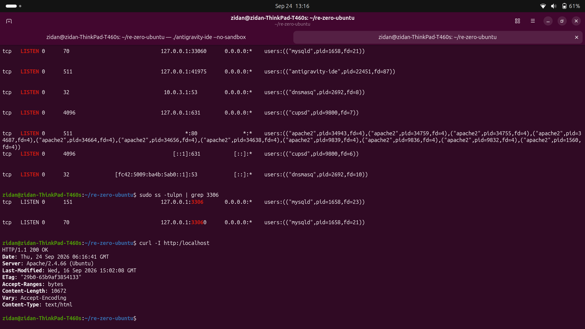
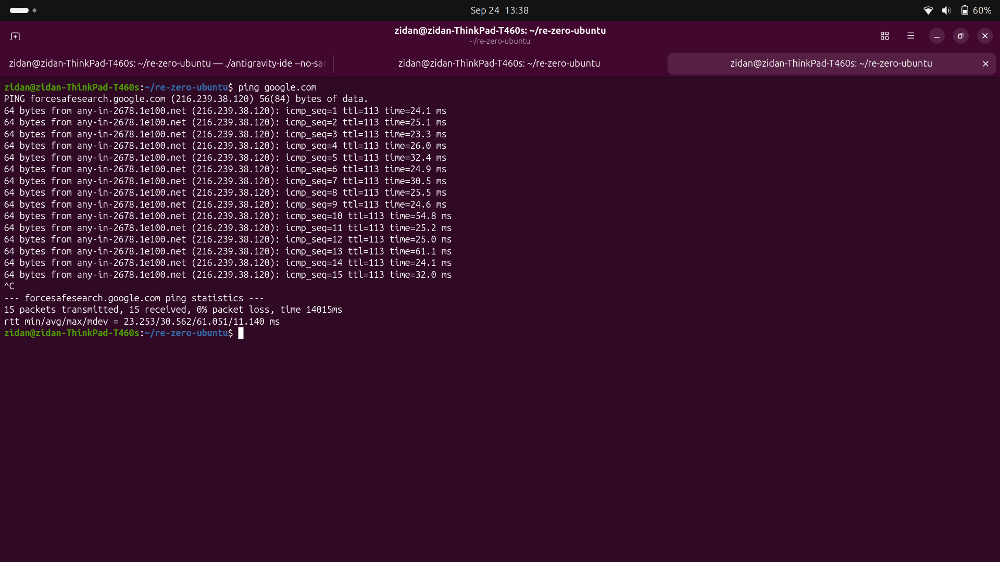

# Day 4 - Basic Networking
## Daily Target
- Learn about networking in Linux.

## What I learned today
1. IP address
2. Port

### IP address
IP address is a unique identifier for a device on a network. To check ip address in linux, use `ip a` command.  

local address: `127.0.0.1` (localhost)  

use `ping <ip-address>` for checking if the device is reachable.  

### Port
PORT is a number that is used to identify a service on a device. To check port in linux, use `ss -tulpn` command.   

Common ports:
- 22: SSH
- 80 or 8080: HTTP / PHP / NGIX / APACHE
- 443: HTTPS
- 3306: MYSQL

Use `curl http://localhost` for checking if http is running.

### Troubleshooting
-

### Screenshots

